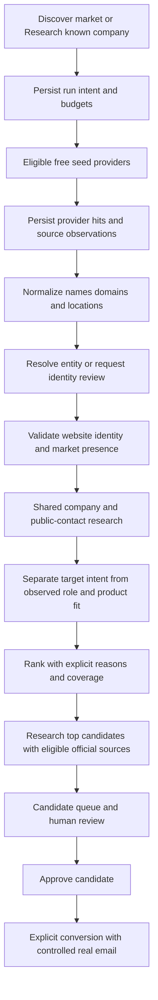
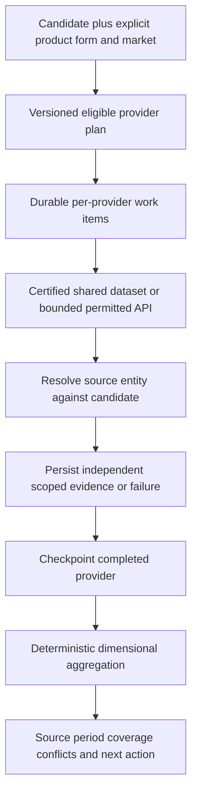

# MDF Outreach — Buyer Finder and Trade Intelligence audit

**Audit date:** 27 September 2026 · **Code baseline:** `5cd96ac` plus the two pre-existing, untracked targeted-company files · **Mode:** investigation only.

No application fixes, migrations, production writes, provider gate changes, paid requests, contact reveals, or messages were made. The companion [remediation plan](<C:/Users/samin/Documents/GitHub/mdf-outreach/docs/buyer-finder-trade-intelligence-remediation-plan.md>)) contains the execution order.

## 1. Executive conclusion

**PARTIALLY: MDF can build an excellent, provenance-led internal buyer-research system with ₹0 automatic provider spend at three searches per day. It cannot promise comprehensive global shipment intelligence, universal procurement contacts, or an always-on commercial production service on the present hosting assumptions.**

Buyer Finder currently finds business-directory candidates, not qualified buyers. Hunter is useful as a supplemental domain seed source, but the current first-20 ingestion, search-intent scoring, incomplete company validation and contact ranking materially limit usefulness. The new targeted action is not yet the same research pipeline and is not ready to be exposed unchanged.

Trade Intelligence has valuable foundations: official sources, explicit non-shipment limitations, server-only credentials, durable jobs, leases, attempts and source snapshots. Its evidence semantics and multi-provider execution are not yet trustworthy enough for a professional default. A rejected Canadian identity can still generate supporting India-origin evidence. US provider failures can disappear from the result. Some conflicts are suppressed by the aggregate. A heartbeat revision is discarded in the multi-provider path.

Prioritize correctness and durable execution before adding sources. Then unlock Canada 2024 and add HMRC UK trader/commodity/month data. Use official directories plus restrained website research for discovery, with Hunter as one optional contributor. GCC and much of Asia need honest coverage labels and a good manual evidence workflow.

There is also a commercial hosting blocker: Vercel Hobby is restricted to personal, non-commercial use. An internal exporter research tool should not assume eligibility merely because it has low traffic. The current deployment plan was not inspected. A permitted paid/existing host, or an existing local machine operated as an internal service, is a separate decision from free data. [Vercel Hobby documentation](https://vercel.com/docs/plans/hobby).

### Non-negotiable contracts

- Candidate ≠ Buyer; approval ≠ conversion. Conversion requires a real email from the existing controlled source set.
- Preserve `BUYER_SEND_ENABLED=false` and `BUYER_FINDER_HUNTER_REVEAL_ENABLED=false`.
- No LinkedIn scraping, guessed conversion emails, fabricated people, shipments, imports or origins.
- No paid fallback, automatic upgrades, credit purchases or trial rotation.
- Every material claim must retain source, subject, scope, period and retrieval time. Unknown remains unknown.
- Market statistics never become company evidence. A search target never becomes evidence that the company buys/imports that product.

## 2. Method, confidence and limits

The audit traced actual actions, routes, repositories, parsers, workers, components and SQL migrations. Existing design documents were context, not proof of implementation. Historical screenshots in `docs/bf4r-screenshots` were inspected for visual hierarchy; this was not a live production browser/accessibility audit.

Verification performed:

| Check | Result | Limit |
|---|---|---|
| Existing Buyer Finder, Buyer Intelligence, Trade Research and route tests | **134 files passed; 1,279 tests passed; two live tests skipped**; 238.74 seconds | Mock/fixture correctness does not establish production quality or current account quotas |
| Ephemeral invocation of actual TypeScript pure functions | Reproduced rejected CID match retaining India, Finance Director leadership ranking, negated/third-party importer claims, and conflict aggregation behavior | CID displayed projection was evaluated from the current worker expression; no production job was created |
| Read-only HTTP range probes of official Canadian resources | 2024: 22,664,154 bytes, ZIP members `xl/workbook.bin` and `xl/worksheets/sheet1.bin`; 2021 CSV: 44,328,073 bytes; both HTTP 206 | No full 2024 parse or row-quality certification was performed |
| Current primary-source research | Official provider documentation, prices, terms and government datasets consulted | Some pages blocked fetching; unknown rights/quotas remain unknown, not inferred permission |
| Workspace review | Initial untracked targeted action/test preserved | Their presence locally does not establish deployment |

The test command was `npm test -- src/lib/buyerFinder src/lib/tradeResearch src/lib/buyerIntelligence src/components/buyerFinder 'src/app/(app)/buyer-finder' src/app/api/buyer-finder src/app/api/internal/trade-research src/app/api/cron/trade-research-drain`.

No authenticated production database, deployed environment, billing dashboard, source account, production queue or current contact yield was queried. No actual useful-company recall percentage, email success rate, purchasing-person precision, or production latency percentile can therefore be claimed. Those require the evaluation protocol in §12. A deterministic 80% of a 100-hit response may be left unprocessed; that is **not** evidence that 80% of useful companies are missed.

### Code evidence index

All paths refer to this audit's checkout. Issue entries refer to these anchors; line numbers may change after implementation.

| Ref | Implementation evidence |
|---|---|
| C01 | [Hunter query construction](<C:/Users/samin/Documents/GitHub/mdf-outreach/src/lib/buyerFinder/providers/hunter/query.ts>)), [company adapter](<C:/Users/samin/Documents/GitHub/mdf-outreach/src/lib/buyerFinder/providers/hunter/companyDiscovery.ts>)) |
| C02 | [20-company cap](<C:/Users/samin/Documents/GitHub/mdf-outreach/src/lib/buyerFinder/searchRun.ts:8>)), [ingestion cap before dedupe](<C:/Users/samin/Documents/GitHub/mdf-outreach/src/lib/buyerFinder/ingestion.ts:577>)), [default relevance](<C:/Users/samin/Documents/GitHub/mdf-outreach/src/lib/buyerFinder/ingestion.ts:269>)) |
| C03 | [Scoring and role rules](<C:/Users/samin/Documents/GitHub/mdf-outreach/src/lib/buyerFinder/scoring.ts>)), [independence label](<C:/Users/samin/Documents/GitHub/mdf-outreach/src/lib/buyerFinder/scoring.ts:481>)), [reveal priority](<C:/Users/samin/Documents/GitHub/mdf-outreach/src/lib/buyerFinder/revealPriority.ts>)) |
| C04 | [Broad dedupe](<C:/Users/samin/Documents/GitHub/mdf-outreach/src/lib/buyerFinder/dedupe.ts>)), [targeted action](<C:/Users/samin/Documents/GitHub/mdf-outreach/src/app/(app)/buyer-finder/targetedCandidateActions.ts:114>)) |
| C05 | [Queue limit](<C:/Users/samin/Documents/GitHub/mdf-outreach/src/app/(app)/buyer-finder/actions.ts:245>)), [candidate repository](<C:/Users/samin/Documents/GitHub/mdf-outreach/src/lib/repositories/supabase/buyerCandidateRepository.ts:24>)) |
| C06 | [Search execution](<C:/Users/samin/Documents/GitHub/mdf-outreach/src/lib/buyerFinder/executeSearchRun.ts>)), [browser launch](<C:/Users/samin/Documents/GitHub/mdf-outreach/src/app/(app)/buyer-finder/BuyerFinderView.tsx>)) |
| C07 | [Free enrichment worker](<C:/Users/samin/Documents/GitHub/mdf-outreach/src/lib/buyerFinder/freeEnrichmentWorker.ts>)), [browser pump](<C:/Users/samin/Documents/GitHub/mdf-outreach/src/components/buyerFinder/FreeEnrichmentAutopump.tsx>)), [drain route](<C:/Users/samin/Documents/GitHub/mdf-outreach/src/app/api/buyer-finder/free-enrichment/drain/route.ts>)) |
| C08 | [People adapter](<C:/Users/samin/Documents/GitHub/mdf-outreach/src/lib/buyerFinder/providers/hunter/personDiscovery.ts>)), [people filtering](<C:/Users/samin/Documents/GitHub/mdf-outreach/src/lib/buyerFinder/personDiscovery.ts>)), [person rank](<C:/Users/samin/Documents/GitHub/mdf-outreach/src/lib/buyerFinder/personRank.ts>)) |
| C09 | [Public-email persistence](<C:/Users/samin/Documents/GitHub/mdf-outreach/src/lib/buyerFinder/publicCompanyContacts.ts>)), [conversion predicate](<C:/Users/samin/Documents/GitHub/mdf-outreach/src/lib/buyerFinder/conversion.ts:185>)) |
| C10 | [Four-page contact crawler](<C:/Users/samin/Documents/GitHub/mdf-outreach/src/lib/buyerFinder/providers/publicWebsite/companyContacts.ts:57>)), [robots fetch after homepage](<C:/Users/samin/Documents/GitHub/mdf-outreach/src/lib/buyerFinder/providers/publicWebsite/companyContacts.ts:463>)), [robots parser](<C:/Users/samin/Documents/GitHub/mdf-outreach/src/lib/buyerFinder/robotsPolicy.ts>)), [same-site policy](<C:/Users/samin/Documents/GitHub/mdf-outreach/src/lib/buyerFinder/sameSite.ts>)) |
| C11 | [Website business extraction](<C:/Users/samin/Documents/GitHub/mdf-outreach/src/lib/buyerFinder/publicWebsiteBusinessExtract.ts:225>)), [business research](<C:/Users/samin/Documents/GitHub/mdf-outreach/src/lib/buyerIntelligence/websiteResearch.ts>)) |
| C12 | [Provider registry/planner](<C:/Users/samin/Documents/GitHub/mdf-outreach/src/lib/tradeResearch/providers.ts>)), [HS mappings](<C:/Users/samin/Documents/GitHub/mdf-outreach/src/lib/marketIntelligence/product.ts>)) |
| C13 | [Trade action's implicit product](<C:/Users/samin/Documents/GitHub/mdf-outreach/src/app/(app)/buyer-finder/tradeResearchActions.ts:87>)), [inline kick](<C:/Users/samin/Documents/GitHub/mdf-outreach/src/app/(app)/buyer-finder/tradeResearchActions.ts:152>)) |
| C14 | [Trade repository and cache](<C:/Users/samin/Documents/GitHub/mdf-outreach/src/lib/tradeResearch/repository.ts:505>)), [snapshot upsert identity](<C:/Users/samin/Documents/GitHub/mdf-outreach/src/lib/tradeResearch/repository.ts:527>)) |
| C15 | [CID identity matcher](<C:/Users/samin/Documents/GitHub/mdf-outreach/src/lib/tradeResearch/canadaCid.ts:340>)), [CID result projection](<C:/Users/samin/Documents/GitHub/mdf-outreach/src/lib/tradeResearch/server/worker.ts:758>)) |
| C16 | [Multi-provider loop](<C:/Users/samin/Documents/GitHub/mdf-outreach/src/lib/tradeResearch/server/worker.ts:1011>)), [discarded heartbeat result](<C:/Users/samin/Documents/GitHub/mdf-outreach/src/lib/tradeResearch/server/worker.ts:1150>)), [aggregation](<C:/Users/samin/Documents/GitHub/mdf-outreach/src/lib/tradeResearch/server/worker.ts:1273>)) |
| C17 | [FSVP parser](<C:/Users/samin/Documents/GitHub/mdf-outreach/src/lib/tradeResearch/fdaFsvp.ts>)), [VQIP parser](<C:/Users/samin/Documents/GitHub/mdf-outreach/src/lib/tradeResearch/fdaVqip.ts>)), [CID parser](<C:/Users/samin/Documents/GitHub/mdf-outreach/src/lib/tradeResearch/canadaCid.ts>)) |
| C18 | [Trade evidence UI](<C:/Users/samin/Documents/GitHub/mdf-outreach/src/components/buyerFinder/TradeResearchPanel.tsx:115>)), [daily cron configuration](<C:/Users/samin/Documents/GitHub/mdf-outreach/vercel.json>)), [cron route](<C:/Users/samin/Documents/GitHub/mdf-outreach/src/app/api/cron/trade-research-drain/route.ts>)) |
| C19 | [Internal drain authorization](<C:/Users/samin/Documents/GitHub/mdf-outreach/src/app/api/internal/trade-research/drain/route.ts>)), [service-role boundary](<C:/Users/samin/Documents/GitHub/mdf-outreach/src/lib/tradeResearch/server/serviceRoleClient.ts>)), [migrations directory](<C:/Users/samin/Documents/GitHub/mdf-outreach/supabase/migrations>)) — 0010/0019/0025 contracts |
| C20 | [BI source/claim model](<C:/Users/samin/Documents/GitHub/mdf-outreach/src/lib/buyerIntelligence/types.ts>)), [metrics](<C:/Users/samin/Documents/GitHub/mdf-outreach/src/lib/buyerIntelligence/metrics.ts>)), [projections](<C:/Users/samin/Documents/GitHub/mdf-outreach/src/lib/buyerIntelligence/projections.ts>)), [derived assessments](<C:/Users/samin/Documents/GitHub/mdf-outreach/src/lib/buyerIntelligence/derived.ts>)) |

## 3. Current Buyer Finder: actual flow and product health

### Discovery and recall

The real broad path is browser → create search-run action → separate execute request → Hunter Discover → normalize → take first 20 → candidate dedupe/create → product match → score → enqueue free enrichment → browser-driven drain → queue/detail. Creating a run does not itself guarantee execution after the browser closes. Search-run recovery can mark an interrupted run, but it does not resume a persisted cursor through the remaining hits. [C01–C07]

Hunter Discover supplies organization/domain seeds. The adapter synthesizes a website from the domain and assigns the requested country to the candidate; it does not persist an independently observed country. Query construction uses headquarters-country filtering and broad OR keywords. Buyer types are ignored. An industry string is added as a keyword rather than mapped to the provider's industry taxonomy. Headquarters selection misses overseas procurement subsidiaries and firms serving a market from elsewhere. Common words such as fresh fruit and spices increase recall but weaken buyer relevance. [C01]

Current Hunter documentation describes free Discover calls with at most 100 results and premium pagination; free accounts must not change restricted pagination parameters. Its API and plan packaging can change. The natural-language AI allowance is distinct from ordinary filter calls; MDF's present structured query should not be costed as 90 AI searches. [Hunter API reference](https://hunter.io/api-documentation), [Discover FAQ](https://help.hunter.io/en/articles/12269815-hunter-discover-faqs).

Repeated identical responses can repeatedly process the same 20 while never reaching the other 80, because the cap precedes entity resolution. Changing a few keywords without storing a query/run hit ledger is not a reliable coverage strategy. There is no measured useful-company recall. The proper experiment is a stable cohort with per-provider unique additions and human relevance judgments, not a guessed missed percentage. [C02]

**Recommended quantity:** acquire up to 100 unique seed hits per run from approved providers; persist all hits and their dispositions; validate 40 initially, prioritized across providers and novelty; deeply research and show the strongest 20 first. Offer “Research next 20” from the retained pool. A 100-company validation run is an explicit additional budget, not the default. At three runs daily this is at most 120 initial validations and 60 deep/automatic trade screens. “20 strongest” is a view, not destructive deletion of the other leads.

### Validation and entity resolution

Current normalization establishes name/country presence and domain/URL syntax. It does not establish that the domain resolves, belongs to the named legal entity, operates in the requested country, is active, or has procurement relevance. A responding parked page is not a validated business. Website email enrichment is not a substitute for a recorded identity validation result. [C01, C02, C10]

Broad dedupe treats exact domain and normalized name+country as high confidence. Domain-only identity can merge separate country subsidiaries. ASCII name normalization drops native-script distinctions; stripping Ltd/LLC helps recall but cannot prove identity. Targeted normalization differs, and its name fallback ignores country altogether. Existing Buyer exclusion is not consistently supplied to the production ingestion path. [C04]

Use a small, reviewable entity model:

1. Preserve original legal/display names, native-script aliases, source country and source entity identifiers.
2. Derive a registrable domain using a maintained public-suffix implementation; distinguish homepage host, domain and legal entity.
3. Resolve by official registration ID+jurisdiction where available. Otherwise require corroborating name, domain and location for automatic reuse.
4. Domain match alone creates a relationship suggestion when jurisdictions/addresses conflict. A shared group domain is not a subsidiary merge.
5. Name-only/fuzzy/transliterated matches are review suggestions. Record match rule/version and reasons. No automatic fuzzy merges.
6. Preserve separate parent/subsidiary/brand/location relationships; never inherit parent trade records as subsidiary facts.
7. Make merges reversible with alias and prior-identity history. Respect existing rejection/archive/Buyer decisions.

### Search intent, business role and product fit

`buyer_candidate_product_matches` currently mixes a requested catalogue product, relevance and evidence. Ingestion assigns missing relevance 50; scoring converts it to 11 product points. Country-fit points can be earned from the country copied from the query. Counting evidence notes can label two copies of one Hunter observation as independent signals. Repeating searches for more products can make a company look more complete without new business evidence. [C02, C03]

Separate three statements:

| Concept | Meaning | Can influence evidence ranking? |
|---|---|---|
| Target product / requested buyer role | What MDF wants to research | No positive evidence points |
| Possible product/business fit | Company catalogue, company description or a sourced directory category | Yes, with scope and source limitations |
| Observed trade/product evidence | Record about the resolved company, product category and period | Yes, only at the record's specificity |

User-entered importer/distributor is intent or an operator assertion, not an independently verified fact. Model roles as non-exclusive: importer, distributor, wholesaler, manufacturer, retailer/procurement group, sourcing firm and broker. Keep provider classification, company self-description and official licensing as separate assertions. A broker may be a discovery lead while being a poor direct purchasing target.

Deterministic extraction can help, but current regexes overclaim. Actual function probes produced `company_is_importer` and `imports_product` for both “We are not importers of mango” and “We supply importers of mango with packaging materials.” The generic word mango also mapped to Banganapalli Mango. These are source-backed strings with incorrect interpretation, not trustworthy claims. Require subject/negation/context rules; preserve generic mango as category evidence, not cultivar evidence. English-only patterns also create substantial unknown coverage for GCC/Asian websites. [C11]

### Contacts and email quality

Website public email is the primary sustainable contact route. Masked people are useful research context, not an email route. The Hunter people query currently uses company name, takes the first 25 and later filters by domain; it may exhaust its result page on the wrong company or miss purchasing staff outside that page. At most eight are persisted. [C08]

Actual role-rule probe: Procurement Manager → tier 1/12 points; Managing Director → tier 2/8; **Finance Director → tier 3/6**; Sales Director and Marketing Director → generic tier 0/2. The unrelated-director exclusion omits finance/accounting. Executive fallback is not conditioned on company size. Broad trader/trading terms also need commodity/business context. [C03]

Recommended order: named purchasing/procurement/strategic sourcing/category or commodity buyer; imports and relevant supply chain; owner/MD only with small-company evidence; public procurement/import mailbox; public general company mailbox as a routing fallback. Separate **role relevance** from **contactability**. A masked procurement person plus a real company mailbox can be useful; do not label the masked person the best usable contact. Sales/marketing/finance/HR/IT get no procurement-role boost unless a separately evidenced buying function exists.

Public-email persistence retains old addresses while updating candidate-level search time. It lacks a clear per-address last-observed/absent/expired distinction. A recent unsuccessful crawl must not refresh an old address. Store first observed, last observed, page URL, extraction method, mailbox type, status and last confirmation independently. Syntax checks are not mailbox deliverability verification. Avoid SMTP probing and guessed patterns. [C09]

The database conversion RPC is stronger than the UI predicate: the UI accepts a syntactically usable contact email where the SQL requires the controlled revealed personal-email provenance. That is a confusing failed conversion rather than evidence of a successful SQL bypass. Align preview with authoritative rules without widening the allowed email sources. [C09, C19]

### Website research and ranking

Contact research has a four-HTML-page cap; business research separately permits six pages. Both can revisit the same homepage and independently consume requests. The shared transport has useful public-IP validation, pinned DNS transport, redirect/body/time bounds and same-site checks. Preserve these. The robots policy is checked after fetching the homepage and has incomplete matching behavior; fix that before expanding crawling. [C10, C11]

Proposed shared crawl: robots first; homepage/about/contact/product pages; maximum four HTML pages for ordinary validation and six total for selected deep research, not four plus six. One concurrent request per host, 1–2 seconds between pages, two hosts globally at first, 10-second request timeout and a 30-second leased slice. Retain existing 1 MiB HTML cap, bounded redirects and 64 KiB robots cap. Cache page hash and extracted facts for 14–30 days, honoring shorter source restrictions. Stop on denied access, CAPTCHA/login, repeated 429 or a robots disallow. A blocked JS-only site becomes “manual research needed”; do not add a general headless-browser farm.

The current 45/40/15 score over-rewards contact data and syntactic completeness. Use transparent bands first: **identity unresolved**, **plausible company**, **relevant company**, **contact ready**, **reviewed/approved**. Within a band, use a published versioned rubric, initially:

| Dimension | Maximum | Rule |
|---|---:|---|
| Identity and target-market presence | 20 | Corroborated identity/location; no points for query country |
| Buying role | 15 | Sourced relevant business function; distinguish company claim from official licence |
| Product fit | 20 | Specificity-aware product/category evidence; target intent scores zero |
| Trade corroboration | 15 | Source grain and period shown; unavailable market coverage is unknown, not a negative fact |
| Contact route | 20 | Real usable controlled email plus role relevance; masked name alone cannot earn email points |
| Freshness and independent corroboration | 10 | Independent source families, not note count; explicit dated rules |

This is a proposed heuristic for calibration, not a measured predictor of buying demand. Show every awarded reason and unknown dimension. Do not compare scores across markets as though official-source coverage were equal. Prefer market-specific queues and “evidence available” badges. A legal identity conflict blocks ready status regardless of points.

### Search history and queue

Runs record useful counters/progress but not a complete durable provider-hit reservoir, per-hit disposition, query variation or validation history. Store `previously_seen`, `already_candidate`, `already_rejected`, `already_buyer`, `new`, `changed_since_last_search` and `needs_review` outcomes. Do not repeatedly enrich unchanged candidates or silently resurrect reviewed rejections. [C02, C06]

The current queue takes the most recently updated 100 before priority sorting. A strong older company can disappear from a priority view. Repository list queries also rely on API response limits rather than complete pagination. Contacts batched by 200 candidate IDs can exceed a default 1,000-row response if several contacts exist per company; actual project limits were not inspected. Use server-side filtered keyset pagination and query-level workspace scope. [C05]

## 4. Current Trade Intelligence: evidence and execution

### Existing source contracts

| Source | Actual evidence grain | Period/cadence | Identity limit | Product / origin / shipment | Reuse and blind spots |
|---|---|---|---|---|---|
| FDA FSVP | Name and US state for an entry-declared FSVP importer | Quarterly participant list; persist its actual publication period | Name+state corroboration, not a legal entity identifier | No product, origin, supplier, quantity, value or shipment rows | Public FDA content generally reusable unless marked otherwise. Listing is not FDA approval and FSVP importer differs from customs importer of record |
| FDA VQIP | Public voluntary program participant; name, address and optional published contact/website | Current researched page is FY2026, ending 30 September 2026 | Address helps; current parser retains less detail and matches name/state | No product/origin/shipment facts | Small voluntary list; omission is weak evidence. Program participation fees are not data access charges |
| Canada CID | Named importer in a major-importer directory at HS6 and origin-country scope for a year | Code is pinned to 2020; official product interface/bulk resource offers 2024 | Name/province does not resolve every branch or namesake | HS category + origin; no company shipment count, supplier, quantity/value or transaction date | Includes brokers/clients and nonresident importers; major-importer coverage is not exhaustive; annual record ≠ present buying demand |

Sources: [FDA FSVP participant scope](https://www.fda.gov/food/importing-food-products-united-states/foreign-suppliers-verification-programs-fsvp-list-participants), [FDA VQIP public list](https://www.fda.gov/food/importing-food-products-united-states/voluntary-qualified-importer-program-vqip-public-list-approved-vqip-importers), [FDA reuse policy](https://www.fda.gov/about-fda/about-website/website-policies), [CID official interface](https://www.ised-isde.canada.ca/site/ised/en/research-and-business-intelligence/canadian-importers-database).

Current configured cache TTLs are approximately FSVP 100 days, VQIP 200 days, CID 365 days. A cache retrieved today can contain evidence from 2020. VQIP's imminent FY rollover is a concrete reason that a 200-day TTL alone cannot express freshness. [C12]

### Canada 2024: unlock it, outside the interactive request

The official [2024 resource](https://ised-isde.canada.ca/site/ised/sites/default/files/documents/cid-bdic-majorimportersbyhs6bycountry2024.xls) is served with an `.xls` extension but its ZIP directory contains binary workbook/sheet members: **XLSB**. The suffix is misleading. The range probe established a 22.7 MB compressed resource, below the current 40 MiB transport cap. The adapter deliberately rejects ZIP workbooks, so raising the byte cap alone would not solve it. The [2021 CSV](https://ised-isde.canada.ca/site/ised/sites/default/files/documents/cid-bdic-majorimportersbyhs6bycountry2021.csv) was 44.3 MB, above that cap. [C17]

Best implementation path: a separate scheduled or operator-run importer on an existing machine, using a maintained XLSB parser; verify schema/year, stream/filter the applicable HS categories, preserve location rows, write an immutable compact derived dataset with a manifest, then publish it to the research cache through a controlled service boundary. SheetJS documents XLSB support; pyxlsb is another candidate requiring compatibility and maintenance evaluation. No library was installed and no dataset was imported in this audit. [SheetJS format support](https://docs.sheetjs.com/docs/miscellany/formats/), [pyxlsb project](https://pypi.org/project/pyxlsb/).

HTTP ranges help identify format and may support ZIP-member retrieval. They are not an HS query engine: binary sheet records/shared strings still require decoding. Do not build a bespoke range/XLSB parser to save one periodic download. Per-HS official screens may be useful manual/small-query alternatives, but a product list and separate country list cannot be joined into company-origin proof without a common published row identifier. Alternate years should be probed and certified, not silently substituted. Keep 2020 as explicitly historical evidence until 2024 passes validation; never relabel it with a new retrieval date.

The open-data record identifies the dataset and licensing context; the licence page was not consistently retrievable during this audit. Preserve the dataset's actual attribution/licence in the importer manifest and verify exclusions before rollout rather than invent unrestricted rights. [Canada dataset catalogue](https://open.canada.ca/data/en/dataset/e5eae1d4-687c-4db2-9273-a 8d2d711144c), [Open Government Licence—Canada](https://open.canada.ca/en/open-government-licence-canada).

### All current catalogue → HS mappings

The inspected active catalogue has four products. Future agricultural items need explicit mappings or `unavailable`; they must not inherit a generic food code. [C12]

| MDF product | Mapping in code | Audit classification | Safe interpretation |
|---|---|---|---|
| Guntur Dry Red Chilli | 090421 primary; 090422 secondary lower-weight mapping | **Proxy** for variety/origin; 090422 also a different preparation | 090421 covers dried Capsicum/Pimenta, neither crushed nor ground. It cannot prove Guntur. Enable 090422 only for explicit crushed/ground intent |
| Banganapalli Mango | 080450 | **Composite** | Guavas, mangoes and mangosteens, fresh or dried. Cannot establish mango, fresh form or cultivar without narrower evidence |
| Indian Pomegranate | 081090 | **Composite** | Other fresh fruit. Cannot establish pomegranate or India by itself |
| Indian Apples | 080810 | **Exact commodity**, not exact origin/variety | Fresh apples. India requires an origin field bound to that company and commodity record |

Authoritative descriptions checked against [CBSA Chapter 9, 2017](https://www.cbsa-asfc.gc.ca/trade-commerce/tariff-tarif/2017/html/00/ch09-eng.html) and [Chapter 8, 2024](https://www.cbsa-asfc.gc.ca/trade-commerce/tariff-tarif/2024/html/00/ch08-eng.html). The code's HS2017 labels should be backed by a stored edition-specific mapping source; this audit did not establish a complete cross-edition concordance. National 8/10-digit subdivisions must retain their jurisdiction and year. Leading zeroes must survive normalization.

The planner chooses one canonical HS6, while a product can have several forms. Persist selected form, mapping class, HS edition and mapping version in the job. “India origin verified” must read “India recorded for this company and HS category in [year]”; it must not silently inherit Guntur/Banganapalli specificity.

### Evidence joins, no-match and conflicts

CID rows are filtered by HS before name/province matching, which is good. However, rejected province matches return their origin countries, and the worker assigns supporting India whenever India exists and the match is not strong. Probe: candidate Example Foods in Ontario, same-name CID row in British Columbia, HS090421, India → identity `rejected`, origins `[IN]`, India `supporting`. This is a **P0 evidence correctness bug**, not a hypothetical coverage concern. The parser also deduplicates by HS+origin+normalized company without location, losing branches before identity matching. [C15, C17]

The trade action chooses the first stored product match and uses latest candidate job without a product-specific selection boundary. A company researched for mango and chilli can display/reuse the wrong product context. Jobs and results must be keyed by workspace, resolved entity, target market, target product/form/mapping version, goal and provider-plan version. Provider snapshots are shareable; company conclusions are not. [C13, C14]

US aggregation preserves positive source entries but only detects geography conflicts between rows already classed verified. A positive CA record and rejected NY namesake is reduced to single-source support. Actual aggregate probe confirmed this. This should surface a possible identity conflict requiring review, not make the NY entry disappear. Conversely, a genuine absence in a small voluntary list is **not** a contradiction of an FSVP match. [C16]

Recommended aggregate dimensions:

- **Identity:** unresolved / corroborated / conflicting. Name+state is corroboration, not legal identity certification.
- **Business/program:** each source's observed participation, with scope and period.
- **Product:** exact commodity / category / proxy / unavailable, separate from target intent.
- **Origin:** bound to the same entity+product/category+period+source observation, or unavailable.
- **Execution coverage:** planned, checked, failed, blocked, unsupported, not started.
- **Recency:** evidence period and publication age; retrieval age separately.

An aggregate is a deterministic explanation referencing all source results. It is not the maximum positive label. Duplicate datasets or sources copied from the same underlying publication form one source family. Two FDA programs provide distinct corroboration but do not become two independent legal-identity certifications.

### Multi-provider robustness: two, three and five

Two US providers work on the happy path. This is not yet a generic fan-out system: the multi-provider function explicitly recognizes only FSVP and VQIP and silently skips unknown providers. Single-provider and multi-provider runners duplicate logic. Adding a third/fifth descriptor alone is insufficient. [C16]

Material execution defects:

1. `withHeartbeat` returns a revised job, but the multi-provider helper keeps only the snapshot. SQL heartbeats increment revision. Later revision-guarded transitions can reject the original job object after a slow fetch. Existing mocks do not establish this database behavior.
2. Multi-provider fetch failures become terminal without the bounded retry treatment in the single-provider path. Failed providers return no source evidence. FSVP no-match + VQIP failure can finalize completed/no-verified-evidence rather than partial.
3. Per-provider evidence accumulates in memory until finalization. Checkpointing between providers resumes from the start; source snapshots/attempts survive, but completed match projections do not. Early cancellation can return a blank result after useful work.
4. The second provider has an insufficient start-budget estimate relative to the 25-second fetch bound, and provider-only helpers do not implement the same stage deadlines. Inline kick starts its deadline after earlier action/database work.
5. Cold snapshot fetches and parsing happen in candidate jobs. Simultaneous candidates can duplicate the same dataset acquisition; whole normalized snapshots are read repeatedly.

Use one generic provider contract and one durable provider-result record per planned provider. Acquire shared datasets independently. Candidate jobs match against validated versions and checkpoint after every provider. All outcomes, including failure/unsupported/skipped, must persist. Keep one authoritative lease revision, fence every mutation, and pass a request-entry deadline through all stages.

## 5. Provider matrices — current evidence, not marketing coverage

Research is dated 27 September 2026. **USE NOW** means a justified implementation candidate after correctness and source onboarding checks; it does not authorize a gate flip in this audit. **INVESTIGATE** means a material entitlement/schema question remains. **MANUAL ONLY** means use the permitted human surface and preserve source notes, without scraping. **REJECT** means exclude from the automatic ₹0 plan, not that the vendor's paid product is poor.

`—` means not supplied by that surface; `?` means unverified. “Public” does not by itself establish automation, commercial reuse, or indefinite caching rights. Reliability judgments below describe format/coverage risk, not measured uptime.

### 5.1 Buyer Finder provider matrix

| Provider/source | Country | Discovery | Company identity | Product | Origin | Shipment | Contact | Recency | Cost | Free quota | Automation allowed | Cache allowed | Licence clarity | Reliability | Recommendation |
|---|---|---|---|---|---|---|---|---|---|---|---|---|---|---|---|
| [HMRC UK traders](https://www.uktradeinfo.com/find-uk-traders) | UK | Strong commodity seeds | Name/address/trader ID | Commodity | — | — | — | Monthly periods | ₹0 | API rate-bound | Yes, open API | OGL conditions | High; exceptions apply | Structured; exclusions | **USE NOW**, first new source |
| [Canada CID](https://www.ised-isde.canada.ca/site/ised/en/research-and-business-intelligence/canadian-importers-database) | Canada/nonresident entries | Strong HS seeds | Name/location | HS6 | Directory field | — | Usually — | 2024 resource; current code 2020 | ₹0 download | No call quota established | Bulk intended | Verify dataset licence | Dataset licence available | Annual/format changes | **USE NOW**, unlock 2024 |
| [FDA FSVP](https://www.fda.gov/food/importing-food-products-united-states/foreign-suppliers-verification-programs-fsvp-list-participants) | US | Food-importer seeds | Name/state | — | — | — | — | Quarterly | ₹0 | Published bulk | Yes, bounded download | FDA policy | High | XLSX/schema drift | **USE NOW**, validate domain |
| [FDA VQIP](https://www.fda.gov/food/importing-food-products-united-states/voluntary-qualified-importer-program-vqip-public-list-approved-vqip-importers) | US program | Tiny supplementary list | Name/address | — | — | — | Published fields | Fiscal year | ₹0 data | Small public list | Bounded public fetch | FDA policy | High | HTML/fiscal rollover | **USE NOW**, minor supplement |
| [Hunter Discover](https://hunter.io/api/discover) | Global, uneven | Business-category seeds | Name/domain lead | Keyword match | — | — | Separate masked route | Web index; age not guaranteed | Free endpoint | 100 response; account limits | Documented API | Internal CRM use; no open-data licence | API clear, retention review | Vendor/coverage dependency | **USE NOW**, optional seed |
| Company websites | Global | Usually enrichment | Self-identified name/location/domain | Claimed catalogue | Claimed only | — | Public email/phone | Page retrieval ≠ publication | No data fee | Per-site policy | Conditional | Minimal facts/excerpts per terms | Varies by site | HTML/robots/languages | **USE NOW**, approved sites |
| [Companies House](https://developer.company-information.service.gov.uk/) | UK | SIC seed, limited buying specificity | Registration/status/address | Broad SIC only | — | — | Not procurement | Filed updates | ₹0 public API | 600/5 min | API key | Applicable public-data terms | Official | Structured, filing lag | **USE NOW** identity adjunct |
| [GLEIF](https://www.gleif.org/en/lei-data/gleif-api/) | Global LEI entities | Poor broad SME discovery | LEI/legal/parent data | — | — | — | — | Dataset updates | ₹0 | Check API rate policy | Documented API | LEI open-data terms | High for LEI data | Structured; SME gaps | **INVESTIGATE**, identity adjunct |
| [Saudi SFDA establishments](https://www.sfda.gov.sa/en/licensed-establishments-list?pg=1) | Saudi Arabia | Licensed sector seeds | CR/licence/location | Sector/activity | — | — | Some published details | Per-entry licence | Public lookup | ? | Bulk/API terms unresolved | ? by resource | Mixed | Site/schema dependency | **INVESTIGATE** food-only |
| [Thailand DBD open data](https://opendata.dbd.go.th/th/dataset/?res_format=JSON) | Thailand | Registry seeds | Registered entity/status | Activity, not traded goods | — | — | Resource-dependent | Dataset-dated | Public data | ? by resource | Resource/API review | Licence review | Resource-specific | Structured potential | **INVESTIGATE** |
| GCC registries/chambers, §5.3 | GCC | Activity/company leads | Registry or member identity | Claimed activities | — | — | Some profiles | Often unclear | Basic public surfaces | ? | Not established | Not established | Varies | Manual friction | **MANUAL ONLY** initially |
| [Gulfood exhibitors](https://exhibitors.gulfood.com/gulfood-2026/Exhibitors) | Global/GCC event | Food-business leads | Exhibitor profile | Categories | Not import origin | — | Profile-dependent | Event year | Public catalogue | ? | Not established | Not established | Directory terms needed | Event snapshot | **MANUAL ONLY** |
| [Anuga exhibitors](https://www.anuga.com/anuga-exhibitors/list-of-exhibitors/) | Global/Europe | Food-business leads | Exhibitor profile | Categories | — | — | Profile-dependent | Event year | Public catalogue | ? | Not established | Not established | Directory terms needed | Event snapshot | **MANUAL ONLY** |
| [Fruit Logistica](https://online.fruitlogistica.com/) | Global/Europe | Fresh-produce leads | Exhibitor profile | Fresh-produce categories | — | — | Some login features | Event year | Public/registration surfaces | ? | Not established | Not established | Platform terms needed | Event snapshot | **MANUAL ONLY** |
| [Sri Lanka EDB](https://www.srilankabusiness.com/exporters/) | Sri Lanka | Manufacturers/exporters | Company profile | Export categories | — | — | Profile-dependent | Profile-dated/unknown | Public | ? | Not established | Not established | Directory terms needed | Exporter bias | **MANUAL ONLY**, role label |

Exhibitors and exporters are often sellers. None of these directories automatically supplies a purchasing requirement. Preserve manufacturer/distributor signals, but do not label every food business an importer.

### 5.2 Trade Intelligence provider matrix

| Provider/source | Country | Discovery | Company identity | Product | Origin | Shipment | Contact | Recency | Cost | Free quota | Automation allowed | Cache allowed | Licence clarity | Reliability | Recommendation |
|---|---|---|---|---|---|---|---|---|---|---|---|---|---|---|---|
| FDA FSVP | US | Yes | Name/state corroboration | — | — | — | — | Quarterly | ₹0 | Bulk, no published numeric cap found | Bounded official download | FDA policy | High | Parser/version checks | **USE NOW** program evidence |
| FDA VQIP | US program | Small | Name/address corroboration | — | — | — | Public fields | FY2026 page | ₹0 | Public list | Bounded official fetch | FDA policy | High | Small, voluntary, HTML | **USE NOW** supplementary |
| Canada CID | Canada | Yes | Name/location | HS6 category | Same directory row | — | — | Annual; 2024 available | ₹0 | Bulk | Bounded dataset fetch | Dataset licence | High after manifest review | XLSB ingestion needed | **USE NOW**, historical scope |
| [HMRC trader data](https://www.uktradeinfo.com/find-uk-traders/how-to-use-our-tool-to-find-uk-traders/) | UK | Yes | Name/address | Commodity/month | **—** | **—** | — | Monthly | ₹0 | 60 requests/min | Open API | OGL | High | Structured, suppression | **USE NOW**, no origin inference |
| [MFDS imported foods](https://impfood.mfds.go.kr/CFCCC01F01) | South Korea | Potential | Named importer | Product text | Manufacturing-country field; validate meaning | Import regulatory record, not BOL feed | — | Record dates | Public lookup | API entitlement ? | Not yet established | Resource terms ? | Needs validation | Promising, local language | **INVESTIGATE** first Asia source |
| [SFDA licensed establishments](https://www.sfda.gov.sa/en/licensed-establishments-list?pg=1) | Saudi Arabia | Yes | Licence/CR | Licensed sector | — | — | Some | Licence dates | Public surface | ? | Not yet established | ? | Mixed | Sector classification risk | **INVESTIGATE**, licence only |
| [UAE Growth registry](https://www.growth.gov.ae/G2C/) | UAE | Licence/activity | Registry identity | Activity only | — | — | ? | Registry state | Basic public surface | ? | Not established | ? | Per service | Login/interactive unknown | **MANUAL ONLY**, identity |
| [Qatar Chamber](https://www.qatarchamber.com/qcci-directory/) | Qatar | Member profiles | Claimed/member identity | Claimed | — | — | Profiles | Profile freshness unknown | Public directory | ? | Not established | ? | Per directory | Not independent trade proof | **MANUAL ONLY** |
| [Oman business services](https://tejarah.gov.om/service-directory) | Oman | Registry/activity route | Registration | Activity only | — | — | Service-dependent | Service-dependent | Public info; request fees ? | ? | Not established | ? | Entitlement unknown | No validated bulk feed | **MANUAL ONLY** |
| [Kuwait Chamber](https://kuwaitchamber.org.kw/) | Kuwait | Company/activity | Chamber record | Activity only | — | — | Published fields | Unknown | Public search | ? | Not established | ? | Per service | Interactive | **MANUAL ONLY** |
| [Bahrain Sijilat](https://www.sijilat.bh/new-cr/new-cr-2.aspx) | Bahrain | Registry/activity | Commercial registration | Activity only | — | — | Resource-dependent | Registry state | Basic lookup; extracts may cost | ? | Not established | ? | Service-specific | Interactive | **MANUAL ONLY** |
| Thailand DBD | Thailand | Yes | Registration/status | Activity only | — | — | Resource-dependent | Dataset period | Public | ? | Resource review | Resource review | Resource-specific | Structured potential | **INVESTIGATE**, identity only |
| [Vietnam registration portal](https://dangkykinhdoanh.gov.vn/en/Pages/default.aspx) | Vietnam | Basic enterprise search | Registered identity | Business lines | — | — | Limited | Registry state | Basic info; paid services possible | ? | Not established | ? | Per service | Interactive | **MANUAL ONLY** |
| Sri Lanka EDB/chambers | Sri Lanka | Exporter/manufacturer | Profile identity | Claimed exports | — | — | Profiles | Unknown | Public profiles | ? | Not established | ? | Per directory | Not importer coverage | **MANUAL ONLY** |
| [China Customs public services](https://online.customs.gov.cn/ocgb/) | China | Enterprise checks | Customs registration/credit | Registration scope | — | — | ? | Registry-specific | Public surfaces | ? | Not established | ? | Per service | Login/CAPTCHA may apply | **MANUAL ONLY** |
| [EU food establishments](https://food.ec.europa.eu/food-safety/biological-safety/food-hygiene/approved-eu-food-establishments_en) | EU | Licensed establishment | Establishment identity | Approved activity | — | — | Varies | List-dated | Public lists | Country-specific | Per-list review | Per-list licence | Fragmented | Animal-sector bias | **INVESTIGATE**, low MDF priority |
| [Singapore SFA track records](https://www.sfa.gov.sg/tools-and-resources/track-records) | Singapore | Establishment checks | Licensed premises | Food activity | — | — | Limited | Scheme/list dates | Public lists | ? | Per resource | Per resource | Resource-specific | Not importer transactions | **MANUAL ONLY**, supplemental |
| Commercial shipment services, §5.4 | Various | Potential | Varies | Often | Often | Often paid | Varies | Vendor-dependent | No sustainable free API established | Trial/sample ≠ recurring | Contract-dependent | Contract-dependent | Unresolved for ₹0 | Payment dependency | **REJECT automatic** |

For **all government directory/registry rows above**, quantity, value and supplier are unavailable on the researched company surface unless explicitly stated. FSVP/VQIP provide program period; CID provides annual directory period; HMRC supplies commodity activity month, not a shipment date. Korea's public detail view can show a product, importer, manufacturing country and import/processing date; quantity/value/supplier/API rights were not validated. It must not be advertised as a ready free shipment provider.

HMRC is unusually valuable: company+commodity+month activity without login/API authorization, with documented pagination. Its trader service excludes trading-partner countries, values, quantities and customers; never join aggregate OTS country data to a trader to infer India. Geographic coverage differs by flow and period. [HMRC API](https://www.uktradeinfo.com/api-documentation), [trader coverage guide](https://www.uktradeinfo.com/find-uk-traders/how-to-use-our-tool-to-find-uk-traders/), [reuse and caching terms](https://www.uktradeinfo.com/terms-and-conditions).

### 5.3 Source access and field details

This table supplies operational details not implied by “free” in the matrices. For an unresolved cell, the connector stays disabled; manual lookup is not authorization to bulk copy.

| Source | Fields relevant to discovery | Interface; login/CAPTCHA | Rate/automation/reuse details and next check |
|---|---|---|---|
| Hunter | Organization/domain; separate people/role/masked data. Current company adapter does not receive authoritative address/industry/product proof | API key; account registration; no CAPTCHA in documented API | Discover 5/sec, 50/min per help. Free ordinary discovery; paid endpoints separate. Terms allow API use, prohibit competing service and do not grant an open-data licence. Confirm account entitlement/retention and disable auto-purchase. [API costs](https://help.hunter.io/en/articles/1970956-hunter-api), [terms](https://hunter.io/terms-of-service) |
| FSVP | Company/state only | XLSX; public; no login in observed source | No numeric download quota found; download shared dataset only on refresh, conditional requests; default FDA reuse rules, no endorsement |
| VQIP | Firm/address/email/website where published; current parser discards email/website | HTML public list | No numeric cap found; fetch once per refresh, preserve FY and source URL. Published email may aid research, but do not add a new conversion source silently |
| CID | Company/city/province/postal, HS6 and origin; no dependable domain/contact | Bulk file and product/city/country screens; public | No numeric cap established. Certify bulk resource and OGL attribution/exclusions; site screens currently mix dataset years, so record year per resource |
| HMRC | Trader name/address/postcode, commodity IDs, months, direction; no domain/contact | JSON OData; no auth | 60/min; follow nextLink, request small pages. OGL content subject to exceptions; source removals must propagate to local use |
| Companies House | Company number/name/status/registered address/SIC; not public procurement contact | API key; public API | 600/5 min. Restrict to public company data and the applicable licence. Do not treat director personal data as procurement leads. [Rate documentation](https://developer-specs.company-information.service.gov.uk/guides/rateLimiting) |
| GLEIF | LEI, legal name/address/status and relationship data; limited small-company coverage | Documented API/bulk | Rate and applicable reuse terms must be captured in manifest before connector; no need to query it for every small food wholesaler |
| Saudi SFDA | CR/licence/type/sector/location and some contact/domain details | Public list/open data; separate API surfaces exist | A food warehouse licence is not necessarily an import licence. Medical-device “importer/distributor” is irrelevant to food. Bulk/API quota and retention rights not verified. Do not reuse keys embedded in examples/pages. [Open-data catalogue](https://sfda.gov.sa/en/open-data?page=1) |
| UAE Growth | Licence/business activities/entity data | Public-facing interactive registry; authenticated behavior not tested | No validated free bulk/API entitlement or retention terms. Old NER endpoints are not a durable integration strategy |
| Qatar Chamber | Member/company profile and contact/category data | Directory/browser; access controls vary | Chamber B2B listings are not guaranteed verification. [Chamber disclaimer](https://www.qatarchamber.com/international-b2b-view/). Quota/cache/automation unverified |
| Oman | Registry services and requested lists by registered activity | Business platform; chamber data request | No validated public automated importer dataset. Company-list requests are a distinct service; price/entitlement must be checked. [Official request service](https://gov.om/en/w/request-private-sector-companies-data) |
| Kuwait / Bahrain | Company/activity/registry fields; some contacts | Interactive browser search; CAPTCHA/login not tested | No verified ₹0 bulk entitlement. Bahrain basic search is distinct from paid certificate/extract services; do not automate a paid workflow |
| Thailand / Vietnam | Registration, company identity and activity | DBD JSON resources / Vietnam portal | Validate exact DBD licence/schema/quota; Vietnam basic lookup does not establish free bulk API. Neither is shipment evidence |
| Sri Lanka | Export categories/manufacturer profile/contact | Public EDB directory | Exporter orientation is explicit. No validated free named importer/shipment API |
| Korea | Imported food product and named importer; manufacturing country/date in public record | MFDS public search/detail; API access not certified | Highest-priority Asia investigation: confirm company entity key, product mapping, country semantics, quotas, storage and commercial rights before automation |
| China / EU / Singapore | Customs/food registration or establishment status | Public service/list; jurisdiction-specific | Check each source's access and reuse contract; food approvals often cover other sectors or foreign suppliers, not target importers |
| Trade events | Name/country/category; optional address/domain/contact | Catalogue, sometimes login/networking tier | Quotas and copy/automation rights unverified. Human shortlist, then company-site validation. Never scrape attendee/private buyer lists |

### 5.4 Commercial/API providers: free is an endpoint entitlement, not a brand

Each current claim below is tied to a primary vendor surface. Unknowns are deliberate. No account was created, card entered, trial activated, or vendor contacted.

| Provider | Current free status / quota | API / automation | Storage/commercial rights | Login, card, rate and hidden requirement | Decision for MDF |
|---|---|---|---|---|---|
| [ImportYeti API](https://www.importyeti.com/yeti-api) | Free examples/sample companies; recurring general-company API quota not established | Other company API data requires a key/pricing entitlement; human-accessible profiles are separate | [Data-use covenant](https://www.importyeti.com/policies/data-use) covers purchased data and excludes free tiers; cannot borrow those rights | Login/access depends on surface; card/rate for free real-company API not verified. [Human usage policy](https://www.importyeti.com/policies/human-usage) distinguishes human use from bulk misuse | **MANUAL ONLY** legitimate visible records; **REJECT** presumed free API |
| [Trademo](https://www.trademo.com/intel/pricing) | No recurring ₹0 company-shipment API quota established | Sales/pricing entitlement | Contract-dependent; not established for free cache | Account/demo; card and rate unknown; subscription dependency | **REJECT automatic**; manual demo only if useful |
| [Volza](https://www.volza.com/pricing/) | Trial/sample offers; no durable free quota established | API/bulk entitlement not established at ₹0 | Retention and commercial rights depend on subscription | Trial and restricted download surfaces; exact account allowance/card/rate unverified | **MANUAL ONLY** trial/sample; no automated dependency |
| [ImportGenius](https://w3.importgenius.com/pricing) | Official pricing says no free trials | Subscription/API access | Subscription terms | Paid entitlement; free API quota zero established, rate/card not applicable to plan | **REJECT automatic** |
| [Panjiva](https://panjiva.com/) | No verified recurring free data/API tier | Commercial service | Contract/licence dependent | Login/sales; no verified free quota/rate/card exemption | **REJECT automatic**; public snippets only manual |
| [TradeAtlas pricing](https://www.tradeatlas.com/en/pricing-data-and-ai-package) | Paid packages; no recurring ₹0 API quota established | [API uses credentials/signature](https://doc.tradeatlas.com/api/sirius/en/) | Purchased licence | Account/paid access; no verified free production key/rate | **REJECT automatic** |
| [TradeImeX FAQ](https://www.tradeimex.in/faqs) | Samples/trial are not a continuing free feed | No verified ₹0 production API | Contract-dependent | Country-dependent subscriptions; free card/rate unknown | **MANUAL ONLY** samples; no automatic fallback |
| [ExportGenius](https://www.exportgenius.in/) | **Unverified**: official homepage returned 403 and pricing resource could not be read | Free API entitlement not established | Unknown | Quota, login, card, rates, retention all unverified; third-party pricing not treated as authoritative | **INVESTIGATE** only with official terms; **disabled** |
| [Dun & Bradstreet lookup](https://www.dnb.com/en-us/smb/duns/duns-lookup.html) | Free human D-U-N-S lookup; not shipment data | [Direct+ API](https://docs.dnb.com/direct/2.0/en-US/entitylist/latest/findcompany/rest-API) needs provisioned access; trial ≠ recurring | API contract; no public-data reuse licence established | Browser/account friction varies; no free production quota/rate verified | **MANUAL ONLY** identity check |
| [Apollo pricing](https://www.apollo.io/pricing) | Free plan exists; exact usable recurring endpoint quota not established for this account | [API pricing/entitlements](https://docs.apollo.io/docs/api-pricing) vary by endpoint/plan | Vendor terms/retention review needed | Login; free-plan card requirement/rate not confirmed; credits and trial allowances must not be conflated | **INVESTIGATE**, not essential |
| [Hunter free plan](https://help.hunter.io/en/articles/11060999-what-s-included-in-hunter-s-free-plan) | Free plan renews; [pricing](https://hunter.io/pricing) shows 50 monthly credits, separately from free discovery | Discover and masked search documented free; reveals/other enrichment may consume credits | API terms, internal use only under applicable terms; not an open resale dataset | API key; inspect account plan and auto-purchase; no credit-consuming endpoint in automatic allowlist | **USE NOW** free endpoints only |
| [Clearbit free-tool sunset](https://help.clearbit.com/hc/en-us/articles/31990018203031-Clearbit-Free-Tools-Sunset-April-30th-2025) | Legacy free tools sunset; do not build on remembered free endpoints | No assumed replacement free enrichment API | No continuing entitlement established | Replacement commercial products ≠ free legacy API | **REJECT** legacy dependency; use registries, website and domain resolution |
| [OpenCorporates API](https://api.opencorporates.com/documentation/API-Reference) | Default documented limits 200/month, 50/day; free access conditional on open/share-alike use | API token; free licence does not automatically fit private proprietary CRM | Paid arrangements remove open-use restriction; MDF must not assume permission | Account/token; rate is not the same as free commercial entitlement | **REJECT automatic** unless licence approved |

**Shipment answer:** No sustainable, general-purpose, legitimate automated company-shipment feed at ₹0 was verified. Limited human-visible shipment records can be useful (for example ImportYeti), and official Korean import records deserve further investigation. Neither establishes comprehensive automated bills-of-lading coverage. Supplier networks, exact volumes/values, shipment frequency and global competitor/customer histories remain fundamentally limited.

## 6. Best multi-provider strategy

Do not run every available provider for every search. At low usage, source diversity and deeper validation beat single-provider latency, but only if each source adds a distinct kind of evidence.

| Market | Primary seeds | Complement | Evidence enrichment |
|---|---|---|---|
| UK | HMRC commodity traders | Hunter + Companies House identity | HMRC period-specific activity; company website/contact |
| Canada | Latest certified CID HS/origin dataset | Hunter for domain discovery | CID historical category/origin + website validation |
| US | FSVP food importer seeds + Hunter | VQIP small public supplement | Independent program participation; website products/contact |
| GCC | Approved official licence/member shortlist or manual known-company input | Hunter + public company websites | Licence/activity assertions, not invented customs records |
| Other Asia | Hunter/manual official directory seeds | Country registry; MFDS investigation | Source-specific coverage; website evidence |
| Continental Europe | Company/sector/event seeds and national identity registries | Hunter + website validation | Do not substitute EU establishment approval for import history |

Run approved seed adapters concurrently, maximum two initially, with independent timeout/result storage. Use deterministic query variants: exact product, broader category and relevant business function, without pretending the provider supports an AND filter it does not. Keep requested filters and actual translated filters in run history. Refresh shared public datasets separately from candidate research. Negative-result caches expire earlier than historical positive evidence and always retain their checked source/period.

Provider onboarding must capture endpoint allowlist, cost class, account entitlement, licence URL/version, commercial-use basis, permitted retention, quota/rate, owner, last review, dataset grain, expected fields and parser/version. A hardcoded `termsApproved: true` is not an operational licence record. Any unknown charge/entitlement blocks the call. Independent failure should give a partial search with explicit coverage, never trigger an unapproved vendor.

## 7. Target architectures

### Buyer Finder exact stages

Broad and targeted entry points must converge before normalization/entity resolution, with the same status lifecycle, provenance, enrichment scheduling and review semantics. A domain-only target creates a provisional display label, not a fabricated legal name. A known company can be researched without pretending it was a broad provider hit. Each provider hit retains its own source; canonical display fields use explicit precedence with provenance and conflict handling.

Automatic trade screening should run for up to 20 identity-resolved, relevant candidates per run, after initial website validation. Reuse a valid result only for the same research context. Unsupported markets get “No approved automated source for this market”; queue no doomed jobs. Keep manual screening available for other candidates. Approval and conversion remain human actions.

### Trade Intelligence exact stages

Adapter contract: `plan(context)`, `acquireDataset/lookup(context,budget)`, `match(entity,records)`, `interpret(match,mapping)`. Provider output must include a versioned status, source/dataset/record IDs, dataset period, retrieved/checked times, entity match reasons, fields supported and unsupported, exact scope, attribution and safe failure code. Execution failure is not evidence absence. Provider completion is idempotent and independently persisted; aggregation can be rerun without refetching.

Use sequential matching inside a small leased job and parallelize independent acquisition at bounded concurrency. Five sources should require five adapter registrations and contract tests, not five branches of a thousand-line worker. Cold bulk imports belong in a separate source-ingestion job, preferably outside constrained request runtimes.

## 8. Evidence recency and salesperson UX

“Current” must be contextual: a source's latest published period is not proof of activity today. Display both **evidence period** and **last checked**; show `latest published`, `historical`, `refresh overdue`, or `publication period unknown`. Preserve historical positives after expiry but do not let them appear recently verified. A 2020 CID result is historical, even if its checksum was checked today. Refresh expectations follow the source's publication calendar, not a universal time score.

Buyer Finder should have two permanent modes:

1. **Discover market:** country/market, product with optional form, desired business roles. Show optional broader-category inclusion. Submit starts a durable run, then opens live results.
2. **Research known company:** company name and/or domain; market and target product are clearly research context. Show existing matches before reuse, and identity conflicts before a merge. Continue into the same company research page.

Use a calm dark-first layout, generous row spacing, accessible contrast and keyboard focus. The current screenshots have a useful restrained base but small muted text, multiple competing evidence/score/reveal labels and a fragmented detail workflow. Do not solve this with more dashboards.

Default results columns: company + website, validated location, why relevant (one strongest scoped reason), contact route, research state, next action. Default sort is actionable within review bands, with user-selectable newest/product/market. Keep rejected/archived/converted filters and explain hidden counts. No fake percentages: show actual “40 hits collected; 18 of 40 validated; 6 need identity review; 2 sources unavailable.”

Company detail has four primary sections: **Company**, **Product fit**, **Contact**, **Trade evidence**. A compact summary can read:

> Food distributor; company website lists spices. Public company email found. Canadian directory records this company under dried pepper/chilli HS090421 with India in 2024. This supports a broad category and origin, not Guntur variety or a recent shipment. Next: confirm purchasing responsibility.

For US:

> One FDA program list corroborates the company name and state. Product and origin are not provided. The second source could not be checked. Next: review the company catalogue and contact route.

Do not use a bare “Verified” pill. Default visible evidence needs source family, period, specificity and failure/coverage state. Details reveal original source link, matched name/address, source record, excerpt, HS description/code, mapping class, parser version and match reasoning. Translate FSVP/VQIP into plain descriptions with abbreviations in details. Explain HS as customs product category and proxy as a broader category than MDF's product.

Review actions must be distinct: approve for Buyer review, reject with reason, archive, research again, convert with email selection. A candidate can be approved yet lack a conversion-eligible email. Sending stays disabled. Avoid making credit/reveal controls the visual focus of a ₹0 workflow.

## 9. Runtime, economics and ₹0 feasibility

### Planning budget, not measured production usage

| Item | Proposed daily ceiling at three runs | Notes |
|---|---:|---|
| Raw unique company seeds | 300 | Up to 100/run across providers; repeated hits can reduce unique count |
| Initial company validations | 120 | 40/run; cache unchanged companies |
| Deep research / automatic trade screens | 60 | Up to 20/run after validation |
| Website HTML requests | 600 | Four pages ×120 plus two extra ×60; pages reused across contacts/business research |
| Robots requests | ≤120 uncached | Thus ≤720 ordinary requests/day; hard transport budget 900 including allowed redirects/retries |
| Hunter broad discovery | Suggested ≤3 queries/run =9/day | Endpoint/account entitlement verified before use; query variants retained |
| Hunter masked people | Optional ≤20/run =60/day | Only if free endpoint and account quota permit; no reveal or paid enrichment |
| Trade provider matches | ≤120/day for two eligible sources ×60 candidates | Usually local/cached matching, not 120 upstream dataset downloads |
| Shared dataset refresh | Typically 0–3 checks/day across current providers | Conditional/cadence-aware; publish immutable versions on change |
| UK API | Start ≤30 small requests/day | Cache commodity/month results; well below published 60/min rate; page count depends on result size |
| Monetary provider spend | **₹0** | Fail closed on quota, unknown entitlement or price-class changes |

Numbers are adjustable safety budgets, not claims that every run needs every request. Nine Discover queries/day must not become a workaround for restricted pagination or account limits. A zero-credit endpoint can still have a call limit. Hunter's 50 free credits are not the budget for this automatic pipeline: keep credit-consuming actions disallowed regardless of unused credit balance.

At 600 pages/day × assumed 100–500 KB average, website ingress is roughly 60–300 MB/day before robots/redirects. This is a sizing assumption, not a measurement. Do not store all page bodies in Postgres. Store minimal extracted facts, source references and hashes; retain licensed compressed artifacts outside the query database only where necessary.

Database estimate: 120 new researched entities/day ×30 days × assumed 10–30 KB of retained candidate/contact/evidence data is **36–108 MB/month before indexes, jobs, events and snapshots**. New unique volume should fall with dedupe, but indefinite retention will still exceed a small free database. Estimate from measured row/table sizes after a pilot. Whole-snapshot egress is `snapshot bytes × candidate reads`; a hypothetical 2 MB FDA snapshot read 1,800 times/month is 3.6 GB, before all other traffic. Shared worker caching or indexed entity lookup matters more than shaving UI requests.

Supabase currently lists a 500 MB free database, 1 GB storage, 5 GB uncached egress plus 5 GB cached egress and pausing after inactivity. This can support a modest internal pilot with retention and pagination; it is not indefinite unlimited storage or an SLA. Actual MDF project usage and configuration are unverified. [Supabase pricing](https://supabase.com/pricing).

For request-based deployment, a sizing scenario is 120–240 validation slices plus 60–120 trade slices/day, with three run creations and a few provider dispatches. Three ten-minute result sessions polled every five seconds add 360 reads per polling stream; separately polling jobs and batches can double that. A reasonable initial target is fewer than 1,000 function requests/day, with visibility-aware polling and shared batch status. These are proposed bounds, not the current measured workload. Database request count will be several times job count unless writes and reads are batched; unlimited API request entitlement does not remove database, egress or compute limits.

Elapsed function time is not CPU time. As an illustrative upper reservation, 120 validation slices using a full 30 seconds each at 1 GiB reserve about1 GiB-hour/day, excluding trade/source/UI work. A measured average 0.5 CPU-second per validation would use about0.5 CPU-hour/month;5 CPU-seconds would use about5 CPU-hours/month before other work. The latter can exceed a small free compute allowance. Benchmark DNS/fetch/parsing and actual memory/CPU on the chosen host before accepting a budget. Large workbook parsing belongs off the interactive function path. These calculations do not make a commercially ineligible hosting plan acceptable.

### Hosting and liveness

The repository explicitly budgets around 60-second routes and a 50-second worker deadline. Current Vercel duration limits depend on runtime/Fluid Compute configuration, so “all Hobby functions always have a 60-second ceiling” is not a current universal platform fact. Preserve the stricter deployed bound until configuration is verified. More runtime does not fix Hobby commercial-use eligibility. [Vercel function duration](https://vercel.com/docs/functions/configuring-functions/duration), [Hobby plan](https://vercel.com/docs/plans/hobby).

`vercel.json` schedules one daily drain, with at most two jobs claimed per invocation. The UI says a few times an hour. At a proposed 60 jobs/day, daily recovery alone can leave up to 58 jobs/day accumulating. Inline kicks can reduce this, but they are not a reliable substitute for adequate unattended capacity. Browser enrichment pumping similarly stalls when no user has the app open. [C07, C18]

Best strict-incremental-₹0 option to evaluate: operate the Node application and durable worker on an existing MDF machine, with a Windows scheduled process/service, protected credentials, an access-controlled internal interface, and Supabase free tier while within limits. No new hosting subscription is required if the hardware/network already exist; electricity, internet, maintenance and operator time are real costs. It is available only while that machine and network are available. A static frontend on a free host does not solve the current Next server actions, Node DNS transport or worker needs. Do not promise a drop-in free cloud migration without a compatibility and terms review.

For every environment: claim small units, heartbeat one authoritative lease revision, checkpoint provider results, retry transient failures with jitter and a cap, respect Retry-After, isolate terminal schema errors, and leave a last-good source snapshot available as explicitly historical. A 30-second work slice with 8–10 seconds for persistence/cleanup is a safer starting point than filling a 60-second request.

## 10. Data model and security recommendations

Reuse the existing Buyer Intelligence sources, claims, observations and derived-assessment concepts. Do not create a competing generic evidence warehouse merely because trade results are currently JSON. The metrics layer already distinguishes evidence level and shipment/transaction granularity; preserve this so directory records cannot increment shipment counts. [C20]

| Existing area | Problem | Minimal target concept |
|---|---|---|
| `buyer_candidates` | Canonical fields mix query defaults and sourced facts; single source flattens provenance | Canonical display plus sourced assertions; provisional identity and field provenance |
| Product matches | Intent/relevance/evidence overloaded | Separate intent from observed fit; specificity, form and mapping version |
| People/public emails | Person identity, role, route and freshness diverge | Stable contact identity; separate role relevance/access; per-email observations/expiry |
| Search runs | No full per-provider hit/disposition ledger | Run-provider execution and persisted hits with novelty/disposition/cursor |
| Trade jobs/plans/attempts/events | Good durable base, incomplete resumable results | Unique context fingerprint and independently durable provider completion |
| Snapshots | Whole JSON rows; cache key ignores parser/filter changes; upsert can replace interpretation of same bytes | Immutable material + parser + schema + period + filter/mapping version identity |
| BI claims/observations | Separate projections can diverge from trade JSON | One versioned evidence interpretation path; no automatic conversion of directory results into shipment observations |
| Lifecycle | Discovery ready, review, research, contact and conversion overlap | Separate state machines with explicit allowed transitions; archive/rejection not erased by refresh |

Use typed/versioned JSON for bounded provider-specific details, with runtime validation and allowed-field checks. Use relational keys/constraints for workspace, subject, source record, period, identity decision, status and uniqueness. Only propose actual schema changes after the state/contract design and a backfill plan; **no migration is included here**. A supplier projection grouped only by normalized name (C20) should not later combine same-name suppliers across countries; keep that limitation explicit before shipment sources arrive.

Security positives from code: service-role client is server-only; trade snapshot writes use server credentials; trade job tables expose workspace-scoped reads, with authenticated writes revoked in the job RPC design; internal drain accepts a constant-time secret path or same-origin owner session; cron requires a secret; public website transport defends against private-IP requests. Conversion checks workspace and controlled email provenance in SQL. [C19]

Residual risks to address without claiming an observed credential leak:

- Candidate repositories rely on RLS membership but omit the selected workspace filter on several reads. A user belonging to two workspaces can have a selected-workspace correctness problem even when unauthorized outsiders remain blocked.
- Buyer Finder tables have broader member CRUD policies than owner-only action semantics. Treat client-editable source/role/review fields as untrusted input; a server action guard alone does not enforce provenance authority at database level.
- Free-enrichment drain accepts an authenticated workspace member without the same owner/origin restriction as trade drain. Scope and rate-limit who can enqueue/drain work; a free provider still consumes compute and quotas.
- The service-role trade worker drains a global queue. For a future multi-workspace deployment, explicitly separate scheduler authorization from owner-triggered workspace work and test fairness/isolation.
- Do not log API query-string keys, scheduler secrets, service keys, contact email payloads or raw HTML. Safe diagnostics should use run/job/provider IDs and bounded error codes. There is no evidence here of browser access to a service-role key; deployed bundles were not inspected.
- Contact information is personal data where applicable. Keep source, purpose, access controls, suppression/deletion and a reviewed retention policy. Public visibility is not permission to scrape LinkedIn or to start sending.

## 11. Observability and source drift

Existing safe trade diagnostics, attempts/events and search progress are useful foundations. Normal troubleshooting still requires correlating several technical surfaces. Build one owner-only **Research health** page, not a collection of analytics dashboards.

Show runs and provider counts; queue age/last progress; last successful scheduler tick; claimed/expired leases; attempts and next retry; source HTTP/format health; dataset period vs retrieval/cache age; parser/schema hash; row counts and retained HS counts; quota remaining/reset; disabled provider reason; p50/p95 latency only when sample count is adequate. Never print credentials. A failed source should be visible from the candidate, run and health view using the same safe code.

Structured events: `run_created`, `provider_started`, `provider_completed`, `hit_resolved`, `validation_completed`, `provider_checkpointed`, `retry_scheduled`, `source_quarantined`, `run_partial`, `run_completed`. Include correlation IDs, elapsed time, bytes and counts; no raw contact payloads. Measure novelty, human acceptance, contact coverage and interpretation accuracy alongside runtime.

Source certification checks: HTTP/content type and magic bytes, ETag/Last-Modified, content hash, parser version, expected schema/header hash, explicit publication period, row count, required-field completeness, country/HS validity and duplicate/location counts. An empty or sharply reduced dataset should be quarantined, not promoted as “no companies import.” Suggested anomaly thresholds (for calibration): zero required rows is always suspicious; >30% unexplained row change or material schema change requires review. Retain the last good snapshot and show its age. A 304 validates unchanged bytes, not compatibility with a newly deployed parser/filter version.

Alert only on actionable changes: failed scheduler, growing queue age, repeated provider failure, quota exhaustion, expired dataset period, source quarantine or violated ₹0 invariant. Retry buttons resume safe units; they do not re-run the whole source pipeline blindly. Export a redacted diagnostic bundle for support.

## 12. Master issue register

Severity follows the brief: P0 correctness/security/data corruption; P1 materially damages usefulness; P2 UX/reliability/maintainability; P3 enhancement. A P0 here is a confirmed false evidence promotion, not a claim of an active security breach. **H** = directly reproduced or clear code path; **M** = code-supported risk needing integration/live validation. Effort: S ≤1 focused day, M 2–4 days, L 5–10 days, XL multi-task work; these are engineering estimates, not promises.

Each entry includes evidence, a reproduction procedure, impact/cause, solution, effort/dependencies and implementation risk. “Reproduction” is a procedure unless explicitly marked executed.

### P0

**TI-01 — Rejected CID identity still supports India origin.** Area: evidence correctness. Severity P0; confidence H. Evidence C15; executed pure matcher + worker-expression probe returned rejected/IN/supporting. Reproduction: same normalized name and HS, candidate ON, source BC, source origin IN. Impact: salesperson receives origin evidence for the wrong entity. Cause: India projection checks presence before rejected identity. Solution: rejected/none identity must exclude all product/origin positives; preserve conflicting rows only as review evidence. Effort S; dependencies none. Risk: existing results need scoped identification and recomputation, not blanket deletion.

### P1

**BF-01 — Search intent earns relevance and market points.** Area: ranking/data semantics. P1; H. Evidence C01–C03. Reproduction: ingest Hunter name/domain with no observed product/country fields; missing relevance becomes 50 and query country matches. Impact: apparent buyer suitability without supporting facts. Cause: overloaded product/country fields. Solution: intent separate from sourced fit; zero evidence points for intent. Effort M; dependency evidence contract. Risk: rankings legitimately change and old scores need versioning.

**BF-02 — First-20 cap starves unseen hits.** Area: discovery. P1; H. Evidence C02. Reproduction: return the same 100 hits on two runs; first 20 are processed both times. Impact: poor novelty and hidden coverage. Cause: cap before dedupe, no cursor. Solution: persist hits, dedupe first, take novel/changed work with resumable cursor. Effort M; dependency run-hit contract. Risk: uncontrolled volume if budgets are omitted.

**BF-03 — Requested buyer types do not constrain Hunter queries.** Area: discovery quality. P1; H. Evidence C01. Reproduction: alter importer/manufacturer selection and compare query; buyer types ignored, industry remains keyword. Impact: business-category matches presented as prospective buyers. Cause: provider capability mismatch. Solution: transparent query translation, category/role variants, post-validation role assertions. Effort M; dependency BF-01. Risk: overly narrow queries reduce recall.

**BF-04 — No explicit company validation stage.** Area: identity. P1; H. Evidence C01/C02/C10. Reproduction: ingest syntactically valid dead/parked domain or mismatched country. Impact: false or wrong-market companies enter ready queue. Cause: syntax normalization treated as readiness. Solution: identity/domain/activity/market validation with unresolved outcome. Effort L; dependency shared crawl contract. Risk: blocked sites must remain unknown rather than rejected businesses.

**BF-05 — Targeted reuse can cross countries; flow bypasses normal research.** Area: targeted workflow. P1; H for local code, deployment unverified. Evidence C04. Reproduction: existing same-name company in another country; submit targeted name without matching domain; existing row reused. Domain-only creates an uppercase domain-label company name. Impact: wrong entity/product association and incomplete research. Cause: name-only fallback, separate normalizer/persistence flow. Solution: shared ingestion/identity pipeline and provisional labels. Effort M; dependencies BF-04/BF-06. Risk: exposing this action before correction spreads bad merges.

**BF-06 — Domain/name dedupe over-merges entities and misses aliases.** Area: entity resolution. P1; H. Evidence C04. Reproduction: shared group domain with country subsidiaries; native-script names; legal-suffix variations across broad/targeted paths. Impact: wrong company history/contact or duplicates. Cause: domain assumed unique legal identity; inconsistent normalizers. Solution: jurisdiction/registration/domain/location matching with reversible review merges. Effort L; dependency evidence contract. Risk: old merged data may need human separation.

**BF-07 — Website regexes misattribute importer and cultivar claims.** Area: business evidence. P1; H, executed. Evidence C11. Reproduction: the two sentences in §3 emit importer/product claims; mango maps to Banganapalli. Impact: evidence-backed-looking false buyer fit. Cause: no negation/subject guard, product short-name promoted to cultivar. Solution: conservative rules, category/variety distinction, excerpts and review state. Effort M; dependency BF-01. Risk: prioritize precision over exhaustive extraction.

**BF-08 — Top-person ranking admits unrelated finance leadership.** Area: contacts. P1; H, executed. Evidence C03/C08. Reproduction: Finance Director receives tier3/6; a masked role can dominate a usable route. Impact: wasted outreach effort. Cause: incomplete negative roles and conflated rank/access. Solution: role taxonomy with department exclusions, company-size executive fallback and independent contactability. Effort M; dependency contact evidence contract. Risk: ambiguous titles need unknown rather than false exclusion.

**BF-09 — Old emails can look freshly researched.** Area: contact freshness. P1; H. Evidence C09. Reproduction: find public email, later crawl no longer finds it; inspect retained address and updated candidate research time. Impact: stale contact reliance. Cause: candidate-level timestamp, no per-email absence/last-seen state. Solution: per-address observations, current/stale/absent semantics. Effort M; dependency contact lifecycle. Risk: a failed crawl cannot prove email removal.

**BF-10 — Queue and repository limits hide candidates.** Area: retrieval. P1; H for 100-view truncation, M for project API cap. Evidence C05. Reproduction: place highest-priority candidate outside newest 100; query many contacts over API row cap. Impact: valuable companies omitted, wrong counts/ranking. Cause: slice before rank and incomplete pagination. Solution: database filters/order/keyset pagination; bounded relation queries. Effort M; dependency rank contract. Risk: pagination changes require stable tie-breakers and workspace indexes.

**BF-11 — Search/enrichment depends on an active browser.** Area: reliability. P1; H. Evidence C06/C07. Reproduction: close after run creation before execute request, or after enrichment enqueues. Impact: stranded research presented as ongoing. Cause: split request launch and browser pump without equivalent unattended runner. Solution: durable scheduling and resumable per-hit work. Effort L; dependency OPS-01/OPS-02. Risk: duplicate runners need idempotency.

**TI-02 — Failed providers disappear; no-match plus failure looks complete.** Area: multi-provider outcomes. P1; H. Evidence C16. Reproduction: FSVP no match, VQIP fetch error; terminal branch yields completed/no_verified_evidence with one source. Impact: incomplete coverage mistaken for a completed check. Cause: errors return no evidence and partial flag handled only for positive branch. Solution: persist every planned provider outcome; coverage drives partial status independent of evidence sign. Effort M; dependency result contract. Risk: legacy single-source UI must not drop new states.

**TI-03 — Multi-provider heartbeat discards revised lease token.** Area: reliability. P1; H code/SQL, integration reproduction pending. Evidence C16 and migration0025 heartbeat revision guard. Reproduction: slow cold fetch >15s, strict writer increments revision, then final stage update uses old revision. Impact: lease loss/retries on normal slow sources. Cause: helper drops `heartbeat.job`. Solution: authoritative mutable lease context or propagate returned job consistently; test against actual RPC semantics. Effort M; dependency none. Risk: concurrency bugs if fencing is weakened instead of fixed.

**TI-04 — Checkpointing replays providers and can lose partial work.** Area: durability. P1; H. Evidence C16. Reproduction: complete FSVP, exhaust budget before VQIP, resume; first provider is rematched; cancel between providers yields blank result. Impact: wasted work and missing useful evidence. Cause: per-provider result only in memory. Solution: durable idempotent completion and resume cursor. Effort L; dependency result contract/TI-03. Risk: legacy attempt rows cannot substitute for evidence without interpretation metadata.

**TI-05 — Aggregation suppresses identity conflicts and overstates verification.** Area: evidence semantics. P1; H, aggregate probe executed. Evidence C16. Reproduction: CA verified + NY rejected same-name record → single_source_support. Impact: strongest-positive behavior hides uncertainty. Cause: conflicts only among verified rows; count of program matches called verified identity. Solution: explicit conflict classification and source-family-aware dimensions. Effort M; dependency result contract. Risk: distinguish absence from contradiction and legitimate multiple locations.

**TI-06 — Product context is implicit and latest-job reuse is too broad.** Area: evidence scope. P1; H. Evidence C13/C14. Reproduction: candidate with two products, request screen without product selection; compare first match/latest job to viewed product. Impact: origin/product conclusion displayed for wrong research context. Cause: context key incomplete. Solution: explicit target context and matching cache/job identity. Effort M; dependency BF-01. Risk: historical jobs without context must be labeled, not guessed.

**TI-07 — CID dedupe discards location-specific records.** Area: parser/identity. P1; H. Evidence C17. Reproduction: same company/HS/origin with BC and ON rows; parser retains one. Impact: false rejection or incorrect location corroboration. Cause: dedupe key excludes location. Solution: preserve full source-row grain and location; collapse only exact duplicates. Effort M; dependency TI-01. Risk: larger snapshots require size monitoring.

**TI-08 — Canada production dataset is 2020 despite newer public data.** Area: source utility. P1; H. Evidence C12/C17 and range probes. Reproduction: inspect configured supported year and current resource. Impact: six-year-old evidence has limited actionability. Cause: CSV-only request-path ingestion. Solution: certify offline/scheduled XLSB2024 importer and immutable derived snapshot. Effort L; dependencies TI-07/TI-09/OPS-01. Risk: new format/year may change field semantics.

**TI-09 — Snapshot identity omits parser/filter version.** Area: cache correctness. P1; H. Evidence C14. Reproduction: deploy new parser/filter for identical source bytes, find old ready snapshot or upsert same hash. Impact: stale interpretations or overwritten reproducibility. Cause: lookup/upsert keyed too coarsely; 304 extends old parse. Solution: versioned immutable interpretation identity, separate material freshness from parser compatibility. Effort M; dependency evidence contract. Risk: backfill/reparse storage expansion.

**OPS-01 — ₹0 hosting model assumes commercial use on Hobby.** Area: operations/economics. P1; H for terms, actual deployed plan unknown. Evidence Vercel sources in §1/§9. Reproduction: confirm deployment plan against commercial-use restriction. Impact: proposed operating model may be ineligible regardless of low volume. Cause: technical limits considered without plan-use terms. Solution: choose permitted existing/local/commercial host before promising production ₹0. Effort M decision; implementation varies. Dependencies none. Risk: local availability or migration compatibility.

**OPS-02 — Scheduled drain capacity contradicts UX and proposed workload.** Area: liveness. P1; H. Evidence C18. Reproduction: queue >2 jobs, remove inline/user activity; daily cron processes at most2/invocation while UI promises frequent runs. Impact: multi-day backlog. Cause: scheduler frequency/cap not sized. Solution: actual worker service/schedule with measured drain capacity and honest status. Effort M; dependency OPS-01/TI-03/TI-04. Risk: increasing frequency before fencing fix causes duplicate work.

**SEC-01 — Selected-workspace scope is weaker than repository contract.** Area: isolation/correctness. P1; M live impact. Evidence C05/C19. Reproduction: user is member of two workspaces; repository list/get/findByDomain without workspace filter. Impact: mixed workspace queue or wrong reuse; no outsider access demonstrated. Cause: RLS permits membership set, repository assumes selected workspace. Solution: explicit workspace predicates and two-workspace integration tests. Effort M; dependency none. Risk: historical cross-context links require review.

### P2

**BF-12 — Evidence notes and a preferred source flatten provenance.** Area: data model. P2; H. Evidence C02, merge capped at 20. Reproduction: ingest multiple providers/notes beyond cap; later observations vanish and canonical source replaces diversity. Impact: cannot explain independent facts or refresh them safely. Cause: small array used as observation ledger. Solution: sourced assertions with canonical display precedence; count families. Effort M; dependency evidence contract. Risk: overbuilding raw-data storage.

**BF-13 — People lookup uses company name and first 25.** Area: contacts. P2; H. Evidence C08. Reproduction: namesake company or relevant role beyond first 25. Impact: procurement person missed despite known domain. Cause: adapter query and no controlled pagination. Solution: domain-bound documented free search, role filters and bounded page handling where entitled. Effort M; dependency provider entitlement check. Risk: accidentally switching to charged Domain Search.

**BF-14 — Conversion preview differs from SQL provenance rules.** Area: conversion UX. P2; H. Evidence C09/C19. Reproduction: syntactically valid contact email without revealed personal provenance appears selectable but RPC rejects. Impact: confusing conversion failure. Cause: weaker shared UI predicate. Solution: mirror authoritative eligibility and safe rejection reasons. Effort S; dependency none. Risk: never relax SQL to match UI.

**BF-15 — Robots/site boundaries need correction before deeper crawl.** Area: crawling. P2; H for ordering/parser, M for broader site-boundary impact. Evidence C10/C11. Reproduction: homepage disallowed by robots still fetched first; wildcard/Allow cases; public-suffix domain validation. Impact: inappropriate crawl behavior and false blocked/allowed decisions. Cause: partial robots parser, no registrable-domain model. Solution: standards-aware robots evaluation before content, maintained PSL, conservative failure policy. Effort M; dependency shared crawler. Risk: changed rules may reduce automatic coverage.

**BF-16 — Duplicate hits/enqueue errors lack a durable repair path.** Area: ingestion reliability. P2; H. Evidence C02/C07. Reproduction: fail between candidate/product/job writes or fail enqueue; rerun. Impact: partially researched candidates without clear recovery. Cause: multi-step writes, swallowed enrichment enqueue failures. Solution: idempotent unit-of-work/outbox or explicit durable pending state; reconcile missing work. Effort M; dependency run-hit lifecycle. Risk: avoid giant cross-provider transaction.

**TI-10 — Source drift can promote empty or undated parses.** Area: source health. P2; H. Evidence C17. Reproduction: structurally valid empty table/workbook or VQIP page without FY; parser may accept zero rows or period “current.” Impact: silent no-match wave or falsely fresh evidence. Cause: missing semantic acceptance checks. Solution: schema/period/row anomaly quarantine and last-good version. Effort M; dependency TI-09. Risk: legitimate publication changes need review override.

**TI-11 — Multi-provider path has weaker deadlines/retries.** Area: runtime. P2; H. Evidence C13/C16. Reproduction: slow VQIP or429/503; provider-only path terminal-fails and budget estimate understates fetch; start kick after slow planning. Impact: avoidable failures/timeouts. Cause: duplicated execution policies. Solution: request-entry deadline, generic adapter budget, bounded transient retries. Effort M; dependencies TI-03/TI-04. Risk: retry storms if error classes/caps are broad.

**TI-12 — Registry additions do not produce generic fan-out.** Area: architecture. P2; H. Evidence C12/C16. Reproduction: add third provider plan; multi-US loop silently skips unrecognized ID. Impact: advertised coverage exceeds actual checks. Cause: provider-specific branching. Solution: typed adapter registry, explicit unsupported outcome, contract tests for2/3/5 providers. Effort L; dependency durable result contract. Risk: premature plugin framework; keep interface small.

**TI-13 — VQIP parser loses useful address/domain/contact evidence.** Area: identity/enrichment. P2; H. Evidence C17 and VQIP source. Reproduction: compare public row fields to parsed result; same-name rows collapse. Impact: weaker matching and lost legitimate research route. Cause: narrow parser schema and name-only dedupe. Solution: preserve source-row grain/address/domain and optional public contact as research evidence. Effort M; dependencies evidence contract/contact provenance. Risk: do not silently expand conversion allowlist.

**TI-14 — Bare verification and hidden period mislead.** Area: UX. P2; H. Evidence C18. Reproduction: inspect default result with old CID or one failure; source details depend on source count. Impact: salesperson cannot see age/scope/partial coverage. Cause: summary fields hide context. Solution: dimension+period+source+coverage summary with source links. Effort M; dependency TI-02/TI-05/TI-06. Risk: replacing jargon with equally vague marketing labels.

**TI-15 — Whole-snapshot reads and cold downloads repeat.** Area: cost/runtime. P2; M measured magnitude unknown. Evidence C14/C16. Reproduction: screen many candidates on same cold dataset; inspect bytes/reads. Impact: avoidable free-tier egress/compute and duplicate acquisition. Cause: source acquisition embedded in candidate jobs. Solution: single-flight source refresh and indexed/bounded matching cache. Effort L; dependency TI-09. Risk: caching must remain tenant-safe and immutable.

**SEC-02 — Owner action checks exceed underlying member write restrictions.** Area: trust boundary. P2; H code, exploitability depends on role policy. Evidence C07/C19/migration0010. Reproduction: active non-owner member attempts direct candidate writes or free drain. Impact: provenance/review mutation or quota consumption beyond intended owner flow. Cause: broad member CRUD and weaker free-drain guard. Solution: document member capabilities, enforce authoritative assertions/review writes consistently, owner/same-origin rate limits. Effort M; dependency workspace policy decision. Risk: avoid breaking legitimate member edits accidentally.

**OPS-03 — No integrated research health or quality baseline.** Area: observability. P2; H. Evidence existing events/logs versus C06/C18/UI. Reproduction: troubleshoot source failure/backlog without SQL/DevTools. Impact: operator cannot distinguish slow, failed, stale and unsupported. Cause: fragmented status and no measured quality cohort. Solution: §11 owner health plus §13 evaluation. Effort L; dependency stable outcome/event contract. Risk: noisy dashboard without actionable states.

**OPS-04 — Retention/refresh policy does not bound free-tier growth.** Area: operations. P2; M production sizes unknown. Evidence C02/C09/C14/C20 and §9 sizing. Reproduction: model months of candidate/event/snapshot retention; inspect table sizes in later authorized QA. Impact: database/egress ceiling and stale personal data. Cause: indefinite accumulation, no source-aware lifecycle. Solution: measured retention, suppression, compact aggregates, immutable evidence references with controlled artifact expiry. Effort M; dependency evidence retention policy. Risk: deleting provenance needed for current claims.

### P3

**OPP-01 — Add HMRC company/commodity/month coverage.** Area: source expansion. P3; H entitlement documentation, connector unbuilt. Evidence §5 HMRC sources. Reproduction: prototype bounded OData sample after authorization. Impact: high-value UK discovery/activity evidence missing today. Cause: current country registry limited to US/Canada. Solution: contract-compliant adapter with no origin/quantity inference. Effort L; dependencies TI-12/TI-09/BF-01. Risk: source omissions and code-version mapping.

**OPP-02 — Investigate Korea/Saudi/Thailand without claiming coverage early.** Area: source expansion. P3; M. Evidence §5. Reproduction: certify small samples, fields and terms. Impact: potential regional gains. Cause: unverified API/licence/entity semantics. Solution: separate feasibility spikes, keep disabled until proof. Effort M each; dependency source manifest/quality gates. Risk: effort yields manual-only outcome; that is acceptable.

**OPP-03 — Calibrate multilingual roles and controlled query diversity.** Area: relevance/recall. P3; M. Evidence C01/C03/C11. Reproduction: human-labelled Arabic/Asian-language website/title cohort. Impact: English-only blind spots. Cause: language-limited rules and provider filters. Solution: reviewed dictionaries/category aliases and explicit unknown fallback; no opaque AI truth score. Effort L; dependencies BF-07/BF-08 and baseline. Risk: false positives from translation/transliteration.

## 13. Quality evaluation and definition of done

Create a fixed, source-linked evaluation set before comparing providers: at least 40 targeted known companies spanning relevant and irrelevant businesses, namesakes, branches and closed/blocked sites; and broad searches across all four products in US, Canada, UK, GCC and one Asian market. Include unsupported-country and no-match examples deliberately. An operator independently labels relevance and contact role; disagreements stay unresolved until reviewed.

Measure with denominators:

- Precision@20 = human-relevant buying businesses / top 20 reviewed, reported by market/product and sample size.
- Incremental useful yield = newly relevant resolved entities contributed by each source / its validated unique hits.
- Novelty and repeated-run overlap (including Jaccard), with unchanged-query versus changed-query cohorts separated.
- Public-email coverage and recent source-confirmed email coverage; named purchasing-person coverage; top-contact role correctness. A masked person is not a usable-email success.
- Identity false merges, wrong-country matches, unsupported product/variety/origin promotions and false importer extraction.
- Queue age, completion/partial/failure rates, resumed work, provider calls, bytes, source cache hits and quota use.

Suggested initial acceptance targets, **not achieved measurements**: ≥80% relevant businesses in top 20 for supported-market pilot cohorts; zero known false entity/product/origin promotions in adversarial fixtures; every failed/skipped provider visible; every displayed claim source-linked and dated; conversion invariant tests pass; unattended completion across a 24-hour user-absence exercise; no secret in client output; zero calls to disallowed/charged endpoints. Contact yield should be baselined and improved rather than setting an invented universal email-coverage promise.

## 14. Stop doing, and the final reality check

Stop treating Hunter rank as buyer rank; repeatedly processing the same first 20; treating query country/product/type as proof; counting note duplicates as independent sources; merging companies solely by domain or name; promoting generic fruit text to cultivars; refreshing old-email freshness on an unsuccessful crawl; treating directory rows as shipments; hiding failed providers; calling name/state corroboration legal identity verification; relying on browser activity for durable work; retrying all providers from zero; using publication-independent cache TTLs; adding more provider branches before a shared execution contract; assuming public webpage equals scraping licence; rotating free trials; relying on discontinued Clearbit endpoints; designing commercial hosting around Vercel Hobby eligibility; and presenting a constant ₹0 label as proof that billing cannot occur.

What can be excellent at this scale: a focused company shortlist, a strong known-company workflow, traceable website/public-contact research, conservative official corroboration, transparent ranking, clear unknowns, recoverable jobs and efficient human review. What remains limited: exhaustive global company recall, reliable purchasing demand, guaranteed procurement-person email, comprehensive shipment/supplier/volume/value history, immediate official data freshness, and an always-on SLA without an eligible hosting/operations budget.

**Final recommendation: PARTIALLY.** Proceed with the remediation plan. The application is salvageable and the low run count makes deeper free research practical. Ship a professional **buyer research and evidence system**, with coverage limitations visible. Do not market or internally treat it as a complete free global shipment-intelligence platform. Resolve the correctness and hosting/liveness decisions before extending automated coverage.
